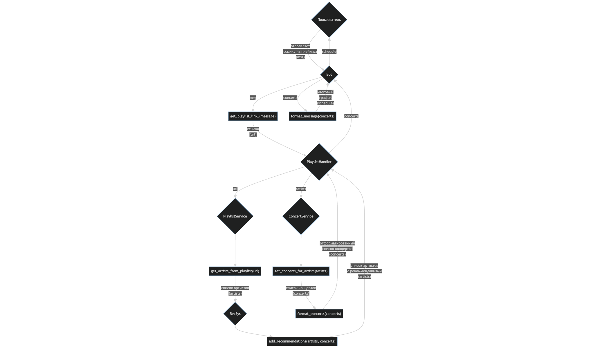

# График концертов по плейлисту

## Описание

Этот проект представляет из себя Telegram-бота, который: 
1. Принимает ссылку на плейлист из Яндекс Музыки. 
2. Анализирует плейлист, извлекая информацию о музыкантах. 
3. Собирает информацию о предстоящих концертах этих музыкантов. 
4. Формирует и отправляет график концертов пользователю. 
5. Использует технологии Яндекса (рекомендательную систему) для обработки запросов пользователей и улучшения интерактивности.

Парсинг данных происходит через внутреннее API яндекса. По ссылке на плейлист получаются ID его треков, по ID треков получаются сами треки. Из описаний треков достаются имена артистов. Далее для каждого артиста получаются его концерты.

Концерты выводятся списком. Пример вывода одного концерта:
🕒 26.12.2025 19:30
🎤 Дора
🌍 Калининград
💵 Цена: 2700 RUB
🔗 Ссылка: https://music.yandex.ru/concert/9a1ed065-ef2c-4e8b-a06c-dffa0b3938c8

Рекомендации можно включить/выключить.

## Цели
1. Изучить работу с aiogram, Docker и облачными средами (~1 день).
2. Изучить работу с принципами SOLID и DRY (~0.5 дня).
3. Имплементировать парсинг плейлистов (вероятно, с использованием API; ~2 дня).
4. Имплементировать бота (~1 день).
5. Покрыть бота тестами (~1 день).

## Примерная схема взаимодействия

## Команда
- Шамаилов Роман Годович: TL, Telegram-бот, докер, валидация (@roman_geek).
- Зайцев Сергей Владиславович: покрытие тестами, форматирование вывода (@cep3au).
- Трондин Артем Романович: основная архитектура (парсинг, запросы к api) (@lilubludok).
- Лавров Степан Андреевич: система рекомендаций (@stepunk7).

## Ссылка на бота
@concert_schedule_bot
